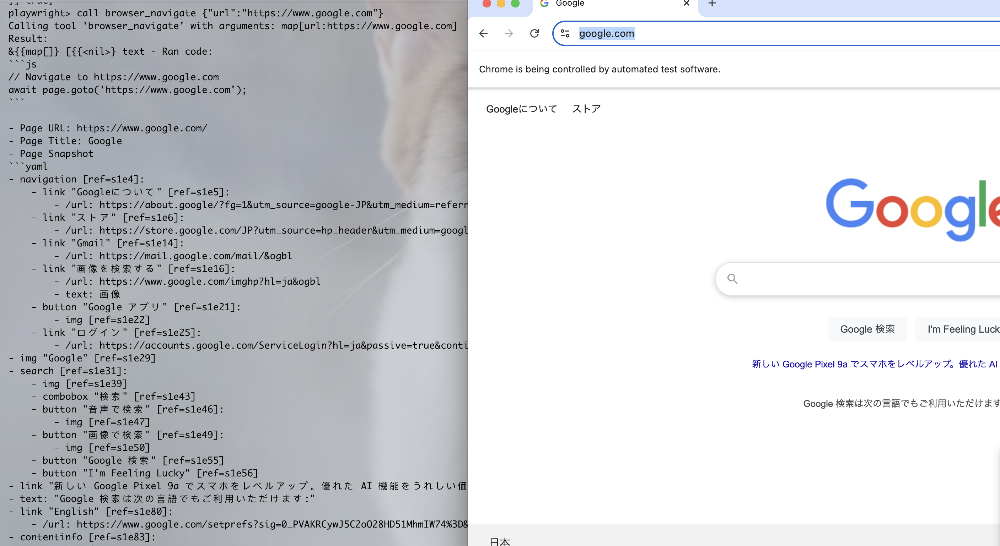

# MCP-CLI

MCP-CLI is a command-line tool for managing and interacting with MCP (Machine Conversation Protocol) servers.

## Features

- Manage multiple MCP servers
- Interactive command-line interface
- Support for viewing and calling server Tools
- Support for viewing server Prompts and Resources
- Support for tool invocation

## Installation
```bash
go install github.com/yourusername/mcp-cli@latest
```

## Configuration

Create configuration file `~/.mcp-cli.json`:

```json
{
  "mcpServers": {
    "playwright": {
      "command": "npx",
      "args": ["@playwright/mcp@latest"]
    }
    ...
  }
}
```

## Usage

### List All Servers
```bash
$ mcp-cli server list
```

| Server Name | Command | Args | Environment |
|------------|---------|------|-------------|
| playwright | npx | @playwright/mcp@latest | |

### Inspect Server
```bash
$ ./mcp-cli server inspect -n playwright
Inspecting server: {Command:npx Args:[@playwright/mcp@latest] Env:map[]}
Initializing MCP client...
Entering interactive shell for server: playwright
Type 'help' for available commands, 'exit' to quit

playwright> tools
total 21 tools
```

| NAME | DESCRIPTION | PARAMETERS |
|------|------------|------------|
| browser_close | Close the page | { "type": "object", "properties": {} } |
| browser_wait | Wait for a specified time in seconds | { "type": "object", "properties": { "time": { "description": "The time to wait in seconds", "type": "number" } }, "required": ["time"] } |

### Interactive Commands
```bash
> tools     # Show available tools
> prompts   # Show available prompts
> resources # Show available resources
> call tool-name {"param": "value"}  # Call a tool
> help      # Show help information
> exit      # Exit
```

### Tool Call Example


## License

MIT License
